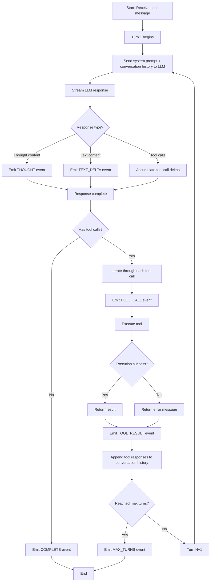

# Agent Harness Architecture & Workflow

The `harness.py` module implements a **multi-turn conversational AI agent** that executes tasks through iterative tool calling loops. This document explains the core architecture and execution flow.

---

## 🏗️ Core Architecture

```
┌─────────────────────────────────────────────────────────┐
│          MinecraftSchematicAgent                        │
│  ┌──────────────┐  ┌──────────────┐  ┌──────────────┐ │
│  │  LLM Service │  │ Tool Registry│  │ Conversation │ │
│  │ (Anthropic/  │  │ (ReadCode,   │  │   History    │ │
│  │  OpenAI/     │  │  EditCode)   │  │              │ │
│  │  Gemini)     │  └──────────────┘  └──────────────┘ │
│  └──────────────┘                                       │
└─────────────────────────────────────────────────────────┘
```

### Key Components

1. **LLM Service** - Provider abstraction layer with streaming support
2. **Tool Registry** - Registers and manages available tools
3. **Stream Response** - Accumulates streaming response chunks
4. **Activity Events** - Pushes real-time status updates to UI

---

## 🔄 Workflow Diagram



---

## 📊 Detailed Execution Steps

### 1️⃣ Initialization Phase

```python
# Select LLM provider (based on API key availability)
available_providers = get_available_providers()
llm = AnthropicService(model, thinking_level)

# Register tools
tool_registry = ToolRegistry([ReadCodeTool(), EditCodeTool()])

# Load system prompt (embed Minecraft SDK documentation)
system_prompt = _build_system_prompt()
```

**System Prompt Construction:**
- Loads template from `prompts/system_prompt.txt`
- Embeds 6 Minecraft SDK documentation files:
  - SDK Overview
  - Scene API Reference
  - Block Reference
  - Block List
  - Terrain Guide
  - Implementation Guidelines

### 2️⃣ Streaming Response Handling

```python
async for chunk in llm.generate_with_tools_streaming(...):
    # Accumulate different types of chunks
    if chunk.thought_delta:
        response.thought += chunk.thought_delta
        yield THOUGHT event
    
    if chunk.text_delta:
        response.text += chunk.text_delta
        yield TEXT_DELTA event
    
    if chunk.tool_calls_delta:
        tool_accumulator.add_delta(chunk.tool_calls_delta)
```

**ToolCallAccumulator's Role:**
- Streaming APIs return tool calls as **incremental deltas** (e.g., argument JSON sent in multiple chunks)
- The accumulator reassembles complete `ToolCall` objects by `index`
- Handles partial function names, arguments, and metadata

### 3️⃣ Tool Execution Flow

```python
for tool_call in response.tool_calls:
    # 1. Parse arguments
    func_args = json.loads(tool_call.function.arguments)
    
    # 2. Inject session_id
    tool_params = {**func_args, "session_id": self.session_id}
    
    # 3. Execute tool
    try:
        invocation = await tool_registry.build_invocation(...)
        result = await invocation.execute()
    except ValidationError as e:
        # Return parameter error to agent (allows it to retry)
        result = ToolResult(error="Missing required: [...]")
    
    # 4. Append result to conversation history
    conversation.append(ToolMessage(..., content=json.dumps(result)))
```

**Error Handling Strategy:**
- All tool errors are caught and converted to `ToolResult` objects
- Agent receives error messages in a structured format
- Enables self-correction (e.g., fixing JSON format, providing missing parameters)

### 4️⃣ Termination Conditions

| Condition | Reason | Success? |
|-----------|--------|----------|
| `GOAL` | LLM returns plain text (no tool calls) | ✅ |
| `NO_COMPLETE_TASK` | LLM returns neither text nor tool calls | ❌ |
| `MAX_TURNS` | Reached maximum turn limit | ❌ |
| `ERROR` | Uncaught exception | ❌ |

---

## 🎯 Key Design Patterns

### 1. **Async Generator Pattern**
```python
async def run(...) -> AsyncIterator[ActivityEvent]:
    # Push events to frontend in real-time via yield
    yield ActivityEvent(type="turn_start", ...)
    yield ActivityEvent(type="text_delta", ...)
```

**Benefits:**
- Non-blocking UI updates
- Progressive rendering of agent thoughts and actions
- Immediate feedback for long-running operations

### 2. **Tool Execution Sandbox**
- All tool errors are caught and returned as structured results
- Agent sees error messages and can attempt to fix issues
- Prevents crashes from malformed tool calls

### 3. **Conversation Context Management**
```python
conversation = [
    {"role": "user", "content": "..."},
    {"role": "assistant", "content": "...", "tool_calls": [...]},
    {"role": "tool", "tool_call_id": "...", "content": "{...}"},
    # ... iterative loop
]
```

**Context Accumulation:**
- Full conversation history sent to LLM each turn
- Enables agent to reference previous actions and results
- Tool results are stored as JSON strings for structured parsing

---

## 💡 Practical Example

**User Request:** *"Create a 5x5 stone platform"*

```
Turn 1:
  → LLM thinking: "Need to generate code..."
  → Tool Call: read_code("main.ts")
  → Tool Result: Returns current code
  
Turn 2:
  → LLM analysis: "Need to add platform function..."
  → Tool Call: edit_code(operation="replace", ...)
  → Tool Result: {success: true, updated_code: "..."}
  
Turn 3:
  → LLM response: "Created 5x5 stone platform"
  → No tool calls → Terminate (GOAL)
```

**Event Stream:**
1. `TURN_START` (turn: 1)
2. `THOUGHT` (delta: "I need to...")
3. `TOOL_CALL` (name: read_code, args: {...})
4. `TOOL_RESULT` (code: "...")
5. `TURN_START` (turn: 2)
6. `TOOL_CALL` (name: edit_code, args: {...})
7. `TOOL_RESULT` (success: true)
8. `TURN_START` (turn: 3)
9. `TEXT_DELTA` (delta: "Created...")
10. `COMPLETE` (reason: GOAL)

---

## 🔍 Debugging Tips

### Inspect Raw Conversation History
The `COMPLETE` event includes the full `conversation` array:
```json
{
  "type": "complete",
  "data": {
    "success": true,
    "conversation": [...]
  }
}
```

### Check Tool Parameter Errors
`TOOL_RESULT` events expose `ValidationError` details:
```json
{
  "type": "tool_result",
  "data": {
    "error": "Invalid parameters for edit_code. Missing required: ['operation']"
  }
}
```

### Monitor Turn Usage
- Adjust `max_turns` to avoid premature or delayed termination
- Typical simple tasks: 2-5 turns
- Complex multi-step tasks: 10-15 turns

### Enable Debug Logging
```python
import logging
logging.getLogger("app.agent.harness").setLevel(logging.DEBUG)
```

---

## 🛠️ Available Tools

### ReadCodeTool
**Purpose:** Retrieve current workspace code  
**Parameters:**
- `filename` (str): File to read (default: "main.ts")
- `session_id` (str): Injected automatically

**Returns:**
```json
{
  "code": "export function build(scene: Scene) { ... }",
  "filename": "main.ts"
}
```

### EditCodeTool
**Purpose:** Modify workspace code with validation  
**Parameters:**
- `operation` (str): "replace" or "append"
- `updated_code` (str): New code content
- `filename` (str): Target file
- `session_id` (str): Injected automatically

**Returns:**
```json
{
  "success": true,
  "updated_code": "...",
  "validation_errors": []
}
```

---

## 🚀 Extension Points

### Adding New Tools
1. Create tool class inheriting from `BaseTool`
2. Register in `MinecraftSchematicAgent.__init__`
3. Tool automatically becomes available to agent

```python
from app.agent.tools.base import BaseTool

class ValidateStructureTool(BaseTool):
    def schema(self) -> dict:
        return {
            "name": "validate_structure",
            "description": "Check if structure meets requirements",
            "parameters": { ... }
        }
    
    async def execute(self, **kwargs) -> ToolResult:
        # Implementation
        return ToolResult(success=True, data={...})
```

### Custom Termination Logic
Override `run()` method to implement custom termination conditions:
- Token budget limits
- Time constraints
- Success criteria validation

### Multi-Provider Support
The harness automatically selects providers based on available API keys:
```python
available_providers = MinecraftSchematicAgent.get_available_providers()
# Returns: {"anthropic": AnthropicService, "openai": OpenAIService, ...}
```

---

## 📈 Performance Characteristics

| Metric | Typical Value |
|--------|---------------|
| Average turns per task | 3-7 |
| Streaming latency | 50-200ms (first token) |
| Tool execution time | 100-500ms |
| Total task completion | 10-60s |

**Optimization Tips:**
- Use `thinking_level="low"` for faster responses
- Implement tool result caching for repeated operations
- Parallelize independent tool calls (future enhancement)

---

## 🔐 Security Considerations

### Session Isolation
- Each agent instance bound to unique `session_id`
- Tools cannot access files from other sessions
- Workspace directories isolated per session

### Tool Safety
- All tool inputs validated via Pydantic schemas
- Malformed tool calls return errors (don't crash)
- Code validation prevents syntax errors in workspace

### API Key Management
- Keys loaded from environment variables
- Provider selected based on available credentials
- No API keys exposed in logs or events

---

This design enables the agent to work like a human developer: **read code → think → write code** through iterative multi-turn interactions!
